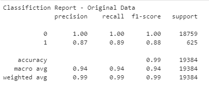
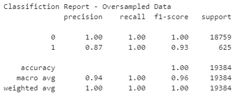

# Unit 12 - Credit Risk Classification

## Background

Credit risk poses a classification problem that’s inherently imbalanced. This is because healthy loans easily outnumber risky loans. In this homework, you’ll use various techniques to train and evaluate models with imbalanced classes. You’ll use a dataset of historical lending activity from a peer-to-peer lending services company to build a model that can identify the creditworthiness of borrowers.

Using your knowledge of the imbalanced-learn library, you’ll use a logistic regression model to compare two versions of the dataset. First, you’ll use the original dataset. Second, you’ll resample the data by using the `RandomOverSampler` module from the imbalanced-learn library.

For both cases, you’ll get the count of the target classes, train a logistic regression classifier, calculate the balanced accuracy score, generate a confusion matrix, and generate a classification report.

As part of your GitHub repository’s `README.md` file, you will create a credit risk analysis report based on the template provided in your `Starter_Code` folder.

- - -

## Files

Download the following files to help you get started:

* [Module 12 Homework Files](Resources/lending_data.csv)

- - -

1. Based on a logical regression using original data set, the accuracy from the result is 99%.

2. Based on a logical regression using over sampling, the accuracy from the result is 100%.

**Conclusion:** By comparing these two reports, the accuracy of using logistic regression model, fit with oversampled data is 100%. The accuracy is extremely high.

---

© 2022 edX Boot Camps LLC. Confidential and Proprietary. All Rights Reserved.
